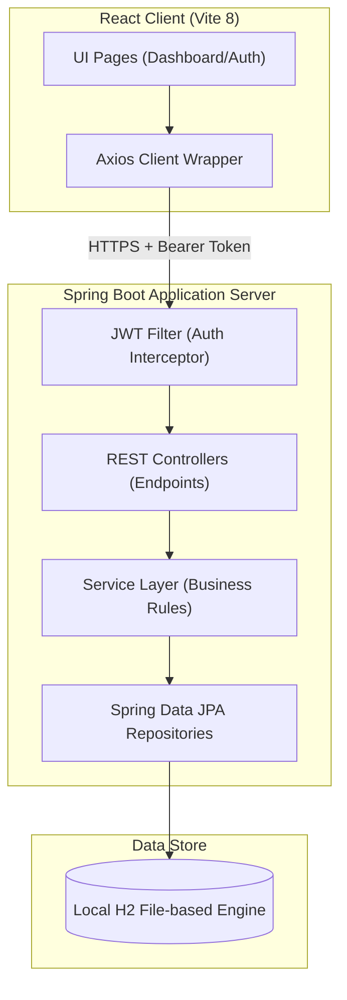
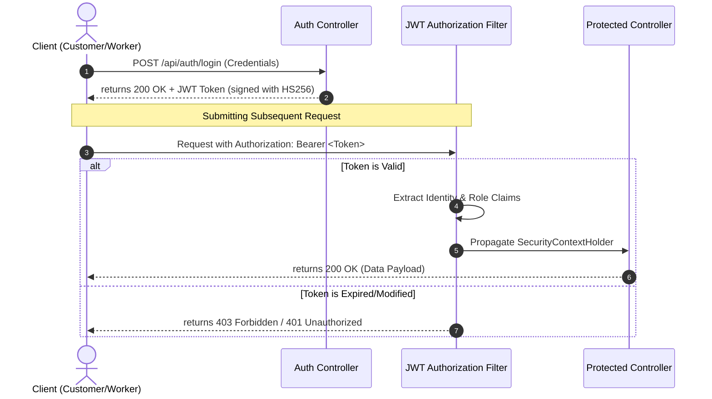

# Sattaees (सत्ताईस)

### High-Fidelity Local Labor Service Platform

Sattaees is a full-stack platform designed to establish a secure, trusted connection between customers and local daily-wage laborers (such as electricians, plumbers, carpenters, and painters). By streamlining the job-booking pipeline, providing token-based authentication, and exposing rating metrics, Sattaees removes intermediation and provides transparent local services.

---

## 🏗️ Architectural Topology

Sattaees employs a decoupled, tiered client-server architecture with stateless REST endpoints and a secure Spring Security middle tier:



---

## 🛠️ Technology Stack & Rationale

### Core Backend Services
- **Spring Boot 3.2.1 (Java 17)**: High-performance microservice framework with dependency injection and built-in configuration servers.
- **Spring Security & JWT**: Stateless session control utilizing JSON Web Tokens (HMAC-SHA256) for secure, role-based boundary verification (CUSTOMER / WORKER).
- **Spring Data JPA**: Abstraction over Hibernate ORM to automate transaction processing and repository query creation.
- **Jakarta Validation (JSR-380)**: Declarative request constraints enforced at the REST layer to prevent database pollution.
- **Lombok**: Automates data model boilerplate (getters, setters, constructors) to enhance codebase maintainability.
- **H2 Database Engine**: Embedded file-based SQL storage enabling immediate testing without active database server dependencies.

### Frontend Interface
- **React 19 & Vite 8**: Ultra-fast build toolchain and component framework.
- **React Router DOM v7**: Declarative routing configuration for secure dashboard flows.
- **Vanilla CSS Variables**: Cohesive HSL theme tokens, glassmorphism filters, and smooth scale hover translations.

---

## 🔒 Security Flow (Stateless Authentication)



---

## 🔌 API Gateway Interface

All endpoints expect JSON request payloads and return structured JSON responses.

### Stateless Authentication
- **`POST /api/customers`**: Customer sign-up. Enforces valid email formats and a minimum 6-character password constraint.
- **`POST /api/customers/login`**: Customer authentication. Returns a signed JWT token containing the account scope.
- **`POST /api/workers`**: Worker registration. Validates category skills, hourly rates, and city locations.
- **`POST /api/workers/login`**: Worker authentication. Returns a signed JWT token containing the worker scope.

### Protected Labor Service Operations
- **`GET /api/workers`**: Returns a list of active workers. Supports optional `skill` and `city` query filter parameters.
- **`POST /api/jobs`**: Books a daily wage job request. Transition state defaults to `REQUESTED`. (Requires Customer Bearer Token).
- **`PUT /api/jobs/{id}/status`**: Transitions the job status workflow (`ACCEPTED`, `COMPLETED`). Validates status flows (e.g. rejects direct transitions from `REQUESTED` to `COMPLETED`).

### Reviews & Ratings
- **`POST /api/reviews`**: Posts worker reviews and ratings. Updates the worker's average rating in the data store.

---

## 📈 System Error Handling Specification

To prevent stack-trace leakages, all exceptions are handled globally. The server returns standard, client-consumable JSON payloads:

```json
{
  "timestamp": "2026-05-31T17:46:50.123",
  "status": 404,
  "error": "Not Found",
  "message": "Worker not found with id 12",
  "path": "uri=/api/workers/12"
}
```

### Managed Custom Exceptions
- **`ResourceNotFoundException`**: Triggered when requested IDs do not match database records. Returns `404 Not Found`.
- **`DuplicateResourceException`**: Triggered on unique constraint violations (e.g., registering duplicate emails). Returns `409 Conflict`.
- **`InvalidJobStatusException`**: Triggered when status transitions violate workflow guidelines. Returns `400 Bad Request`.
- **`MethodArgumentNotValidException`**: Triggered on request validation checks failure. Returns `400 Bad Request` with an array detailing each violation field.
