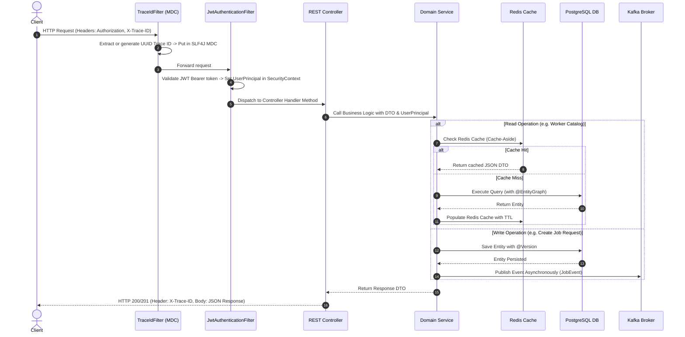

# Sattaees Architecture: Modular Monolith Overview

## 1. System Vision & Architecture Paradigm

Sattaees is architected as a **Modular Monolith**. Rather than decomposing prematurely into microservices with distributed transaction complexity, network overhead, and operational drag, Sattaees enforces strict logical and domain boundaries within a single deployable artifact.

```mermaid
graph TD
    subgraph Client Tier
        Browser["React Single Page Application"]
        Mobile["Mobile / API Consumers"]
    end

    subgraph Edge & Security Tier
        Nginx["Reverse Proxy (Nginx / Cloud Load Balancer)"]
        TraceFilter["TraceIdFilter (MDC Correlation ID)"]
        SecurityFilter["JwtAuthenticationFilter (Stateless Bearer Verification)"]
    end

    subgraph Modular Monolith Domain Boundaries
        AuthModule["auth (AuthController, TokenProvider, RefreshTokenService)"]
        CustomerModule["customer (CustomerController, Service, Repository, Entity)"]
        WorkerModule["worker (WorkerController, Service, Repository, Entity, Cache)"]
        JobModule["job (JobController, Service, Repository, Entity, State Machine)"]
        ReviewModule["review (ReviewController, Service, Repository, Entity)"]
        NotificationModule["notification (Kafka Consumer, Idempotent Dispatcher)"]
        CommonModule["common (BaseEntity, GlobalExceptionHandler, ErrorResponse, DTOs)"]
        InfraModule["infrastructure (RedisConfig, KafkaConfig, SecurityConfig, OpenApi)"]
    end

    subgraph Data & Storage Tier
        Postgres[(PostgreSQL 15 - Primary Relational DB)]
        Redis[(Redis 7 - Cache & Invalidation)]
        KafkaBroker[(Apache Kafka - Event Streaming & DLT)]
    end

    Browser -->|HTTP REST / Bearer Token| Nginx
    Mobile -->|HTTP REST / Bearer Token| Nginx
    Nginx --> TraceFilter
    TraceFilter --> SecurityFilter
    SecurityFilter --> AuthModule
    SecurityFilter --> CustomerModule
    SecurityFilter --> WorkerModule
    SecurityFilter --> JobModule
    SecurityFilter --> ReviewModule

    CustomerModule --> Postgres
    WorkerModule --> Postgres
    WorkerModule -->|Cache-Aside (Profile / Catalog / Search)| Redis
    JobModule --> Postgres
    ReviewModule --> Postgres

    JobModule -->|Publish Job Events| KafkaBroker
    ReviewModule -->|Publish Review Events| KafkaBroker
    KafkaBroker -->|Subscribe Consumer Group| NotificationModule
```

---

## 2. Domain Module Boundaries & Responsibilities

| Module | Core Responsibility | Persistence & Dependencies |
| :--- | :--- | :--- |
| **`auth`** | User authentication, password verification (BCrypt), JWT access & refresh token issuance, token revocation. | `refresh_tokens` table, `CustomerRepository`, `WorkerRepository`. |
| **`customer`** | Customer account lifecycle, personal profile management, resource ownership verification. | `customers` table. |
| **`worker`** | Worker directory, skills, availability status, hourly rate, average rating aggregation, Redis caching. | `workers` table, Redis cache (`worker_profile`, `worker_catalog`, `worker_search`). |
| **`job`** | Service booking lifecycle (`REQUESTED` -> `ACCEPTED` -> `IN_PROGRESS` -> `COMPLETED`/`CANCELLED`), optimistic locking, worker availability toggling. | `job_requests` table, `customer`, `worker`, Kafka Producer. |
| **`review`** | Feedback ratings (1-5 stars) and comments, atomic worker rating re-computation, review event emission. | `reviews` table, `WorkerService`, Kafka Producer. |
| **`notification`**| Asynchronous event consumption from Kafka, idempotency deduplication, simulated multi-channel alerting (SMS, Email, Push). | In-memory deduplication set, Kafka topics. |
| **`common`** | Cross-cutting domain concerns: `BaseAuditableEntity` (auditing + optimistic locking), `GlobalExceptionHandler`, standard `ErrorResponse`, pagination. | Framework utilities. |
| **`infrastructure`** | Spring Security, JWT provider, Redis & CacheErrorHandler, Kafka & DLT error handler, OpenAPI/Swagger, JPA auditing. | Framework & middleware drivers. |

---

## 3. Standard Request Lifecycle & Correlation Tracking

Every incoming HTTP request undergoes the following lifecycle:


