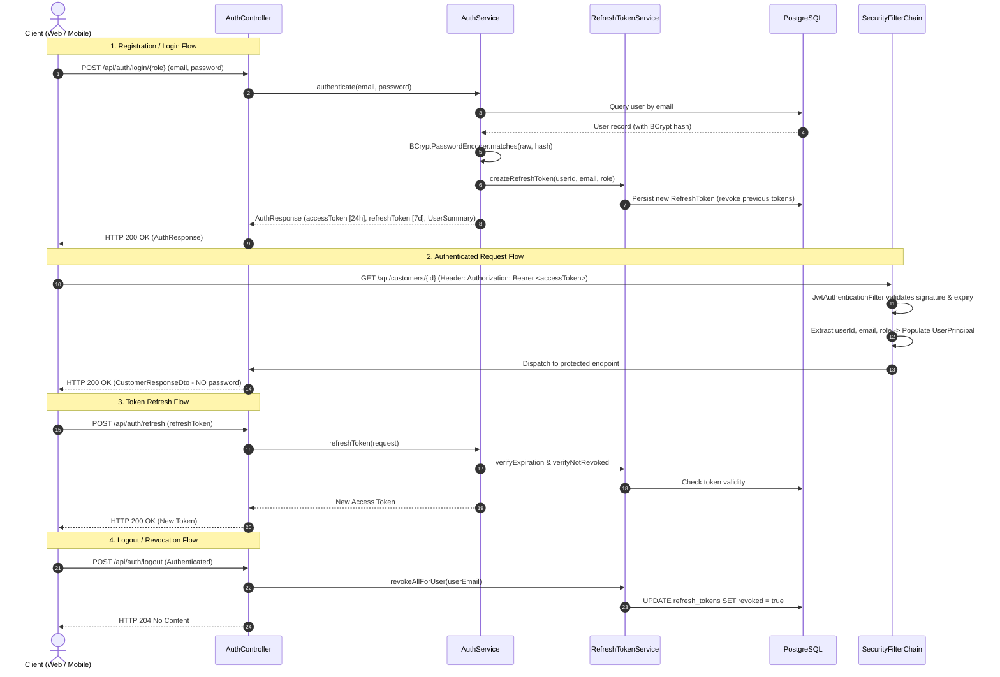

# Sattaees Architecture: Security, JWT & Authorization

## 1. Authentication Architecture

Sattaees implements a **Stateless Token-Based Authentication Architecture** using JSON Web Tokens (JJWT) with HMAC-SHA256 signing, complemented by database-backed Refresh Tokens for revocation and session management.



---

## 2. Password Security & Credential Hygiene

1. **BCrypt Hashing**: Passwords are never stored in plain text. Passwords pass through `BCryptPasswordEncoder` with a cost factor of 10.
2. **Zero Password Leakage**:
   - JPA entities are never serialized to HTTP responses.
   - `AuthResponse` returns a lightweight `UserSummaryDto` containing only `id`, `name`, `email`, and `role`.
   - `CustomerResponseDto` and `WorkerResponseDto` exclude password fields entirely.
3. **Safe Profile Updates**:
   - `CustomerUpdateDto` and `WorkerUpdateDto` disallow password mutations during general profile edits, preventing accidental overwriting of hashes.

---

## 3. Authorization & Resource Ownership Strategy

Sattaees combines **Role-Based Access Control (RBAC)** with **Resource Ownership Verification**:

### Roles
- `ROLE_CUSTOMER`: Can book services, view own jobs, submit reviews, and manage personal profile.
- `ROLE_WORKER`: Can accept/start/complete assigned jobs, toggle availability, view own reviews, and manage personal expert profile.
- `ROLE_ADMIN`: Superuser authority for system governance.

### Resource Ownership Enforcement
In methods such as `CustomerService.updateCustomer` and `WorkerService.updateWorker`:
```java
private void verifyCustomerOwnership(Long id, UserPrincipal currentUser) {
    if (currentUser == null) {
        throw new UnauthorizedException("Authentication required.");
    }
    boolean isAdmin = currentUser.getAuthorities().stream()
            .anyMatch(a -> a.getAuthority().equals("ROLE_ADMIN"));
    boolean isOwner = currentUser.getId().equals(id) && "CUSTOMER".equalsIgnoreCase(currentUser.getRole());

    if (!isAdmin && !isOwner) {
        throw new UnauthorizedException("You are not authorized to modify this customer profile.");
    }
}
```
This prevents **Insecure Direct Object Reference (IDOR)** vulnerabilities where an authenticated user attempts to mutate another user's profile.

---

## 4. CSRF Rationale for Stateless APIs

### Why CSRF Protection is Disabled in Sattaees:
Cross-Site Request Forgery (CSRF) exploits automatic credential attachment by browsers:
1. When session cookies (`JSESSIONID`) are used, the browser automatically attaches the cookie to any cross-origin request made to `api.sattaees.com`.
2. Sattaees uses **stateless Bearer JWT tokens** stored in application memory/storage and transmitted explicitly via the `Authorization: Bearer <token>` HTTP header.
3. Browsers **never** automatically attach custom `Authorization` headers to cross-site requests. Therefore, standard CSRF attacks cannot succeed, making synchronized CSRF tokens redundant for this architecture.
