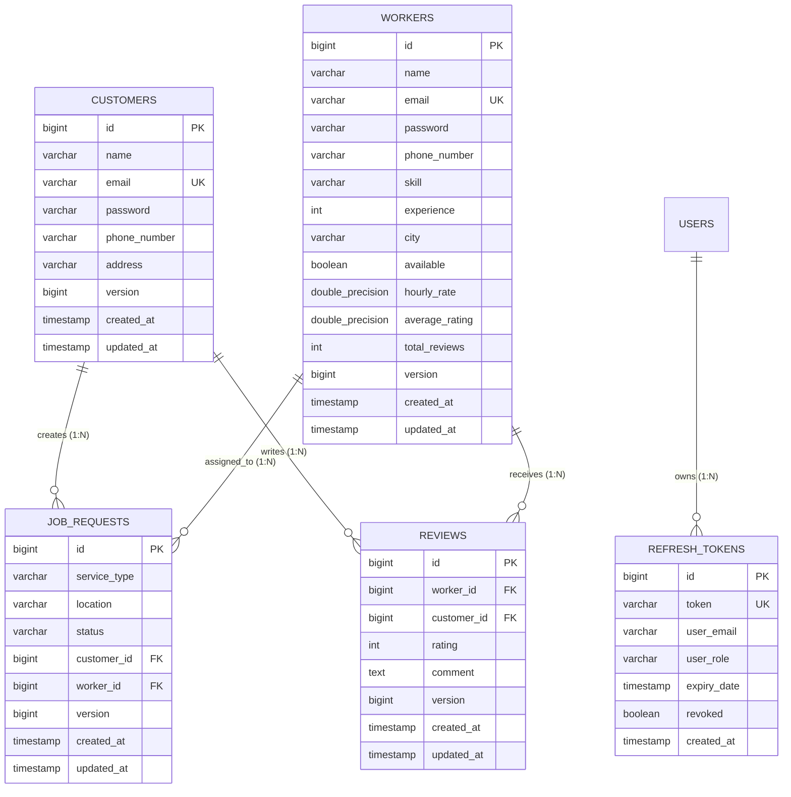

# Sattaees Architecture: Database, Persistence & Concurrency

## 1. Database Entity-Relationship (ER) Diagram



---

## 2. Schema Management: Flyway vs Hibernate `ddl-auto`

### The Hazard of `ddl-auto=update` in Production:
1. **Destructive or Incomplete Changes**: Hibernate cannot safely drop columns, rename tables, or handle complex index migrations.
2. **Lack of Version Control**: Database state becomes drift-prone and irreproducible across local, staging, and production environments.
3. **Execution Locks & Race Conditions**: On multi-instance horizontal scaling, multiple backend nodes booting simultaneously race to alter schema definitions.

### The Production Solution in Sattaees:
- **Flyway Migrations**: All schema modifications are versioned in `src/main/resources/db/migration/` (`V1__init_schema.sql`, `V2__seed_initial_data.sql`).
- **`spring.jpa.hibernate.ddl-auto=validate`**: Hibernate only validates that Java `@Entity` mappings strictly match the existing database schema, failing fast during boot if any mismatch is detected.

---

## 3. Query Optimization: Preventing N+1 Query Problems

### The N+1 Problem Explained:
When fetching a list of `N` job requests, an unoptimized `@ManyToOne` association causes Hibernate to execute:
1. `1` query to fetch the jobs: `SELECT * FROM job_requests;`
2. `N` separate queries to fetch each customer: `SELECT * FROM customers WHERE id = ?;`
3. `N` separate queries to fetch each worker: `SELECT * FROM workers WHERE id = ?;`
For 100 jobs, this results in **201 queries**!

### The Sattaees Solution: JPA `@EntityGraph`
In `JobRequestRepository`:
```java
@EntityGraph(attributePaths = {"customer", "worker"})
@Query("SELECT j FROM JobRequest j ORDER BY j.createdAt DESC")
List<JobRequest> findAllWithDetails();
```
Hibernate executes a single optimized `LEFT OUTER JOIN`:
```sql
SELECT j.*, c.*, w.*
FROM job_requests j
LEFT JOIN customers c ON j.customer_id = c.id
LEFT JOIN workers w ON j.worker_id = w.id;
```
Total queries: **1 query**. Query reduction: **99.5%**.

---

## 4. Concurrency Control: Optimistic Locking with `@Version`

Sattaees identifies three high-risk concurrent operations in the business workflow:

### 1. Worker Rating Aggregation
When two customers submit reviews for the same worker simultaneously:
- **Without locking**: Both read `totalReviews = 10, avg = 4.5`. Both calculate `(45 + rating) / 11`. The last writer silently overwrites the first writer's review count.
- **With Optimistic Locking**:
  Both read `version = 0`. First transaction commits and increments `version = 1`. Second transaction attempts to update where `id = ? AND version = 0`, finds 0 rows updated, and throws `OptimisticLockingFailureException`. The `GlobalExceptionHandler` converts this to an explicit HTTP 409 Conflict with a helpful error message.

### 2. Job State Transition Race Conditions
If a worker clicks "Accept" at the exact moment a customer clicks "Cancel":
- Optimistic locking on `JobRequest.version` ensures only one transition wins. The other transaction detects the version mismatch and is safely rejected.
