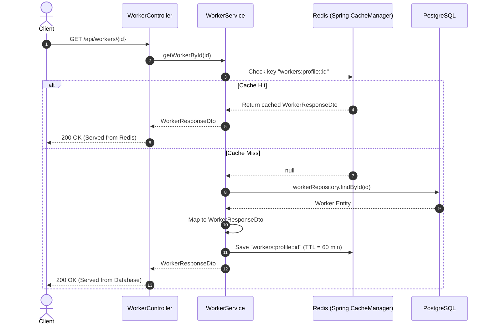
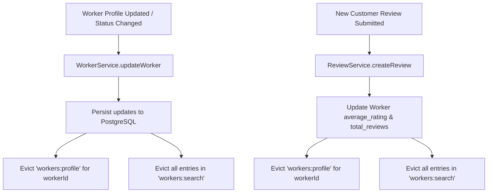

# Sattaees Architecture: Caching & Redis Strategy

## 1. Caching Philosophy & Purpose in Sattaees

In a daily wage marketplace like Sattaees, browse and search traffic significantly outnumbers transactional write traffic:
- **Read-heavy operations:** Listing workers, filtering by skill or city, and viewing a worker's public profile occur on almost every customer screen load.
- **Write operations:** Creating a job request, updating availability, or posting a review occur at discrete transaction moments.

Without caching, every search page hit hits the relational database with multi-column queries (`skill`, `city`, `available`). Under peak load (e.g. morning peak hours when contractors book labor), the PostgreSQL database would experience CPU spikes and connection pool exhaustion.

Redis is introduced to implement the **Cache-Aside (Lazy-Loading)** pattern with automated invalidation and graceful degradation.

---

## 2. Cache-Aside Workflow



---

## 3. What is Cached and Why?

| Cache Name | Cache Key | Content | TTL | Reason for Caching |
| :--- | :--- | :--- | :--- | :--- |
| `workers:search` | `'all'` | `List<WorkerResponseDto>` | 10 minutes | High-frequency query on homepage and worker search directory. Reduces full-table scans. |
| `workers:profile` | `#id` (e.g., `workers:profile::12`) | `WorkerResponseDto` | 60 minutes | Worker detail views are frequently viewed during booking decisions. Contains aggregated rating & profile data. |

### What is NOT Cached?
- **Job Requests (`job_requests`):** Job status changes rapidly through a state machine (`PENDING -> ACCEPTED -> IN_PROGRESS -> COMPLETED -> CANCELLED`). Caching stateful transactions risks stale status visibility for customers and workers.
- **User Authentication / Passwords:** Never cached in application caches. User credentials and password hashes are strictly managed via BCrypt and database lookups or ephemeral JWT validation.
- **Reviews List:** Reviews are paginated and append-mostly; caching paginated slices creates cache fragmentation and high invalidation complexity.

---

## 4. Cache Invalidation Strategy

Cache invalidation is triggered synchronously within transactional business methods using Spring's `@CacheEvict`:



### Invalidation Annotations in Code:
```java
// In WorkerService.java:
@Caching(evict = {
    @CacheEvict(value = "workers:profile", key = "#id"),
    @CacheEvict(value = "workers:search", allEntries = true)
})
@Transactional
public WorkerResponseDto updateWorker(Long id, WorkerUpdateDto updateDto) { ... }

// In ReviewService.java:
@Caching(evict = {
    @CacheEvict(value = "workers:profile", key = "#dto.workerId"),
    @CacheEvict(value = "workers:search", allEntries = true)
})
@Transactional
public ReviewResponseDto createReview(CreateReviewDto dto) { ... }
```

---

## 5. Resilience: What Happens When Redis is Down?

A critical flaw in naive Spring Cache setups is that if Redis crashes or network connectivity is interrupted, cache read/write calls throw `RedisConnectionFailureException`, causing 500 Internal Server Errors on otherwise healthy read endpoints.

Sattaees prevents this by implementing a custom **`LoggingCacheErrorHandler`**:

```java
@Configuration
@EnableCaching
public class RedisConfig extends CachingConfigurerSupport {

    @Override
    public CacheErrorHandler errorHandler() {
        return new LoggingCacheErrorHandler();
    }
}
```

### Behavior Under Redis Failure:
1. **Cache Read Failure:** If Redis is down during a `@Cacheable` call, the error handler logs a `WARN` event:
   ```text
   WARN [traceId=...] LoggingCacheErrorHandler : Redis cache GET failure on cache 'workers:profile' for key '12'. Falling back to database: Unable to connect to Redis
   ```
2. **Fallback Execution:** Spring continues method execution and queries PostgreSQL directly.
3. **Cache Put/Evict Failure:** Write failures are logged without aborting the database transaction.
4. **Client Impact:** The client experiences a minor latency increase (direct DB query), but the API continues returning `200 OK` rather than failing.
