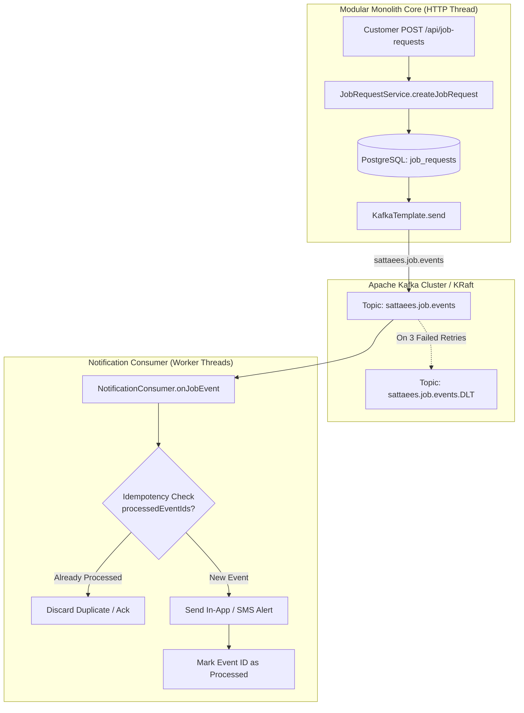

# Sattaees Architecture: Event-Driven Processing with Apache Kafka

## 1. Why Apache Kafka in Sattaees?

In the original flat architecture, job creation or review submission either:
1. Performed synchronous blocking calls (e.g., placeholder simulation of sending an SMS/email alert to a worker or customer).
2. Or omitted notifications entirely, tightly coupling HTTP request lifecycles to external side effects.

### The Production Problem:
- **High latency:** Sending an SMS or email notification via a third-party gateway (Twilio, SendGrid) takes 200ms–2000ms. If executed inside the HTTP thread, the user waits needlessly.
- **Cascading failures:** If the notification provider or push server is down or timing out, the customer's job booking request fails, rolling back an otherwise valid database transaction.
- **Temporal decoupling:** When a customer books a job at 2:00 AM, the notification service might need to queue, throttle, or batch worker alerts.

Kafka decouples **state change persistence** (synchronous PostgreSQL transaction) from **downstream side-effects** (asynchronous notification, audit logging, analytics).

---

## 2. Event Architecture Diagram



---

## 3. Topics & Event Schemas

### Topic Definitions
- `sattaees.job.events`: Emitted when any lifecycle transition occurs on a job (`CREATED`, `ACCEPTED`, `COMPLETED`, `CANCELLED`).
- `sattaees.job.events.DLT`: Dead-letter topic capturing poison-pill or unprocessable job events after max retry attempts.
- `sattaees.review.events`: Emitted when a customer leaves a review for a worker.
- `sattaees.review.events.DLT`: Dead-letter topic for review processing failures.

### Event Models

#### 1. `JobEvent`
```json
{
  "eventId": "f47ac10b-58cc-4372-a567-0e02b2c3d479",
  "eventType": "JOB_CREATED",
  "jobRequestId": 105,
  "customerId": 3,
  "workerId": 14,
  "serviceType": "PLUMBING",
  "status": "PENDING",
  "timestamp": "2026-09-26T18:30:00"
}
```

#### 2. `ReviewEvent`
```json
{
  "eventId": "8c59638f-9a4f-4d92-938a-1310656a735c",
  "reviewId": 42,
  "workerId": 14,
  "customerId": 3,
  "rating": 5,
  "comment": "Prompt service, fixed the leak in 30 minutes.",
  "timestamp": "2026-09-26T19:00:00"
}
```

---

## 4. Resilience & Error Handling: Retry and Dead Letter Topics (DLT)

To prevent message loss while avoiding consumer pipeline blockage caused by malformed or failing payloads ("poison pills"), Sattaees configures a **`DefaultErrorHandler`** with a **`DeadLetterPublishingRecoverer`**:

```java
@Bean
public ConcurrentKafkaListenerContainerFactory<String, Object> kafkaListenerContainerFactory(
        ConsumerFactory<String, Object> consumerFactory,
        KafkaTemplate<String, Object> kafkaTemplate) {

    ConcurrentKafkaListenerContainerFactory<String, Object> factory =
            new ConcurrentKafkaListenerContainerFactory<>();
    factory.setConsumerFactory(consumerFactory);

    // Dead-letter publisher sends failing record to <original_topic>.DLT
    DeadLetterPublishingRecoverer recoverer = new DeadLetterPublishingRecoverer(kafkaTemplate);

    // 3 retry attempts with 1-second fixed backoff before sending to DLT
    DefaultErrorHandler errorHandler = new DefaultErrorHandler(recoverer, new FixedBackOff(1000L, 3L));
    factory.setCommonErrorHandler(errorHandler);

    return factory;
}
```

### Lifecycle of a Failing Event:
1. Consumer pulls `JobEvent` from `sattaees.job.events`.
2. Listener throws an exception (e.g., transient network failure connecting to SMS gateway).
3. `DefaultErrorHandler` catches the exception and retries message consumption 3 times at 1-second intervals.
4. If all 3 attempts fail, the `DeadLetterPublishingRecoverer` routes the message to `sattaees.job.events.DLT` along with diagnostic headers (`kafka_exception-message`, `kafka_exception-stacktrace`).
5. Offset for the main topic is committed, allowing subsequent healthy events to be processed without stopping the consumer pipeline.

---

## 5. Consumer Idempotency Strategy

Kafka provides **at-least-once delivery** semantics. Network timeouts between the consumer committing offsets and the Kafka broker can lead to message redelivery.

If a notification consumer processes a `JOB_CREATED` event twice, the worker could receive duplicate SMS alerts or charges.

### Sattaees Idempotency Pattern:
1. Every event generated by producers embeds a globally unique `eventId` (UUID).
2. The `NotificationService` checks an in-memory/cache store of processed event identifiers:
```java
@Service
public class NotificationService {
    private final Set<String> processedEventIds = ConcurrentHashMap.newKeySet();

    public void handleJobEvent(JobEvent event) {
        if (!processedEventIds.add(event.getEventId())) {
            log.warn("Duplicate JobEvent received with ID: {}. Skipping notification.", event.getEventId());
            return;
        }
        // Proceed with alert delivery
    }
}
```
3. In a distributed multi-instance deployment, this deduplication set is backed by Redis key operations (`SETNX eventId EX 86400`).
