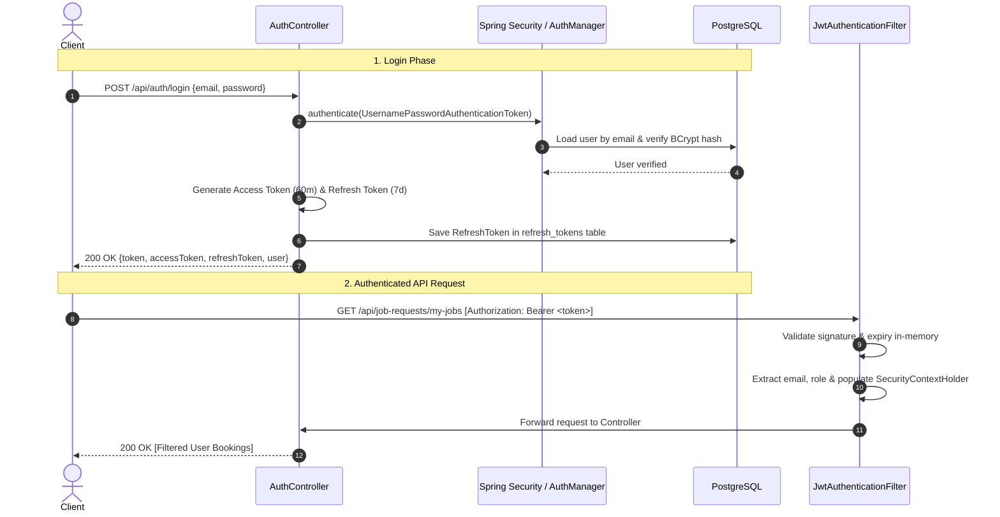

# Backend Engineering Guide: Spring Security & JWT Authentication

## 1. What Problem It Solves
Traditional web applications authenticate users using **Stateful HTTP Sessions** (`JSESSIONID` cookies stored in server memory). In modern distributed systems, stateful sessions introduce major architectural problems:
- **Horizontal Scaling Bottleneck:** When deploying multiple instances behind a load balancer, instances require sticky sessions or a shared distributed session store (e.g., Redis session replication).
- **Mobile Compatibility:** Native iOS/Android apps prefer token-based authentication headers over browser cookies.
- **CSRF Vulnerability:** Cookies sent automatically by browsers on cross-origin requests expose apps to Cross-Site Request Forgery (CSRF).

**Stateless JWT (JSON Web Token) Authentication** solves this by packaging the authenticated user's identity and authorities directly inside a cryptographically signed token sent in the `Authorization: Bearer <token>` header.

---

## 2. Why Sattaees Needs It
Sattaees serves two distinct user classes: **Customers** (hiring workers) and **Workers** (offering trades):
- Both require secure account creation, BCrypt password hashing, and authentication.
- Workers must only be able to view their own assigned jobs and update their own availability.
- Customers must only be able to view and cancel their own bookings.
- The platform needs to support web browsers and future native mobile apps without server-side session affinity.

---

## 3. How It Works
The architecture employs a **Dual-Token System**:



---

## 4. How It Integrates with Spring Boot
Spring Boot 3 uses **component-based security configuration** via `SecurityFilterChain` beans (deprecating the older `WebSecurityConfigurerAdapter`):

```java
@Configuration
@EnableWebSecurity
@EnableMethodSecurity(prePostEnabled = true)
public class SecurityConfig {

    @Bean
    public SecurityFilterChain securityFilterChain(HttpSecurity http) throws Exception {
        return http
            .csrf(csrf -> csrf.disable()) // Safe for stateless bearer tokens
            .sessionManagement(s -> s.sessionCreationPolicy(SessionCreationPolicy.STATELESS))
            .authorizeHttpRequests(auth -> auth
                .requestMatchers("/api/auth/**", "/swagger-ui/**", "/v3/api-docs/**", "/actuator/**").permitAll()
                .requestMatchers(HttpMethod.GET, "/api/workers/**").permitAll()
                .anyRequest().authenticated()
            )
            .addFilterBefore(jwtAuthenticationFilter, UsernamePasswordAuthenticationFilter.class)
            .build();
    }
}
```

---

## 5. What Happens Internally
1. **Request Interception:** Every inbound request hits `JwtAuthenticationFilter` (an implementation of `OncePerRequestFilter`).
2. **Signature Verification:** `JwtTokenProvider` validates the HMAC-SHA256 signature using `Keys.hmacShaKeyFor(secret.getBytes())`.
3. **Security Context Population:**
   ```java
   UsernamePasswordAuthenticationToken authToken =
       new UsernamePasswordAuthenticationToken(userPrincipal, null, userPrincipal.getAuthorities());
   SecurityContextHolder.getContext().setAuthentication(authToken);
   ```
4. **ThreadLocal Storage:** Spring Security stores the authentication in `SecurityContextHolder` using a `ThreadLocal`. Any downstream service or controller can access the logged-in user via `@AuthenticationPrincipal UserPrincipal user`.
5. **Thread Cleanup:** At the end of the HTTP filter chain, Spring Security's `FilterChainProxy` automatically clears the `ThreadLocal` context, preventing identity leaks across pooled Tomcat threads.

---

## 6. Alternatives
| Mechanism | Description | Best Used When |
| :--- | :--- | :--- |
| **Stateless JWT** | Tokens signed with secret; verified in-memory | REST APIs, mobile backends, microservices |
| **Stateful Sessions** | `JSESSIONID` stored in Redis/Memcached | Traditional server-rendered MVC apps (Thymeleaf) |
| **OAuth2 / OIDC** | Delegated identity (Keycloak, Auth0, Google Sign-In) | Enterprise Single Sign-On (SSO) |
| **API Keys** | Fixed strings passed in headers | Server-to-server machine integrations |

---

## 7. Trade-offs
### Advantages:
- **Stateless Verification:** Validating access tokens requires 0 database queries, providing massive throughput for read APIs.
- **Cross-Domain Ready:** Tokens work seamlessly across different mobile apps, third-party clients, and domain boundaries.

### Limitations:
- **Revocation Delay:** Because access tokens are self-contained and stateless, an intercepted access token remains valid until its expiration (60 minutes in Sattaees).
- **Mitigation:** Sattaees pairs short access token lifetimes with database-tracked **Refresh Tokens** that can be revoked immediately upon logout or password change.

---

## 8. Common Mistakes
1. **Disabling CSRF Without Stateless Tokens:** Disabling CSRF is only safe when authentication relies purely on request headers (`Authorization: Bearer`). If an app uses browser cookies for JWTs, CSRF protection is mandatory!
2. **Putting Sensitive Data in JWT Payload:** JWT payloads are Base64URL-encoded, NOT encrypted. Anyone can decode and inspect the payload. Never store passwords, PINs, or PII in JWT claims.
3. **Hardcoding JWT Secrets in Code:** Storing secrets in `application.properties` or source code committed to Git allows anyone with repo access to forge admin tokens. Always use environment variables (`JWT_SECRET`).
4. **Not Using BCrypt:** Storing plaintext or MD5/SHA-256 hashes of passwords. SHA-256 is fast, making it vulnerable to brute-force attacks via GPUs. BCrypt includes salt and configurable work factor to defend against rainbow tables and brute force.

---

## 9. Interview Questions & Answers

### Q1: What is the structure of a JWT?
**Answer:** A JWT consists of three parts separated by dots (`.`):
1. **Header:** Algorithm and token type (`{"alg": "HS256", "typ": "JWT"}`).
2. **Payload:** Claims containing subject, expiration, roles, and custom claims.
3. **Signature:** Cryptographic hash of `Base64URL(Header) + "." + Base64URL(Payload)` generated with a secret key or private RSA key.

### Q2: Why is CSRF disabled in stateless JWT APIs?
**Answer:** CSRF (Cross-Site Request Forgery) exploits browser behavior where cookies are automatically attached to cross-site requests. In a stateless API using `Authorization: Bearer <token>`, the token must be explicitly read from storage (e.g. `localStorage` or memory) and injected via JavaScript into the HTTP header. Malicious cross-site scripts cannot access these headers or force the victim's browser to send them, eliminating CSRF vulnerabilities.

### Q3: How do you handle user logout in a stateless JWT architecture?
**Answer:**
1. **Client-side:** Delete the access and refresh tokens from storage.
2. **Server-side (Dual Token):** Mark the refresh token as `revoked = true` in the database, preventing renewal.
3. **Blacklisting (Optional):** Store the access token's `jti` (JWT ID) in Redis with a TTL equal to the token's remaining lifetime. On sensitive endpoints, check Redis for blacklisted IDs.
