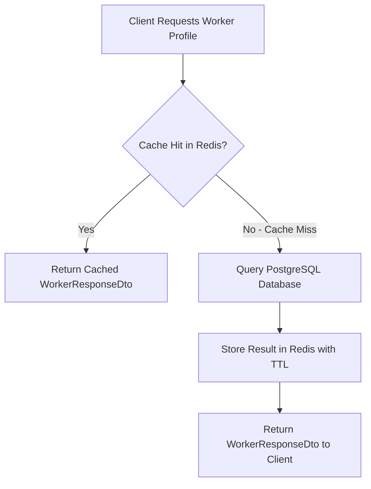

# Backend Engineering Guide: Redis Caching & Cache-Aside Strategy

## 1. What Problem It Solves
Relational databases (PostgreSQL, MySQL) store data on persistent disk volumes (or SSDs) organized in B-Trees with transactional logging (WAL). While optimized for ACID consistency, executing complex multi-column filter queries on millions of rows incurs disk I/O, CPU sorting, and connection pool lock contention.

**In-Memory Caching with Redis** stores frequently accessed data in RAM. RAM access speeds (~100 nanoseconds) are thousands of times faster than disk I/O (~1-10 milliseconds), reducing database CPU load by 80-95% and slashing API response times.

---

## 2. Why Sattaees Needs It
In Sattaees, customer browsing is read-dominated:
- Thousands of customers browse workers by category (Electrician, Plumber, Painter) and city.
- Worker profile details (experience, hourly rate, average rating) are viewed repeatedly before booking.
- Worker profiles rarely change throughout the day.
- Caching `workers:search` and `workers:profile` eliminates repetitive PostgreSQL table scans while ensuring sub-5ms API response times.

---

## 3. How It Works: The Cache-Aside Pattern
Also known as **Lazy Loading**:



### Invalidation on Mutation:
When a worker updates their profile or a customer posts a review, Sattaees invalidates the cache:
```java
@Caching(evict = {
    @CacheEvict(value = "workers:profile", key = "#id"),
    @CacheEvict(value = "workers:search", allEntries = true)
})
@Transactional
public WorkerResponseDto updateWorker(Long id, WorkerUpdateDto updateDto) { ... }
```

---

## 4. How It Integrates with Spring Boot
1. **Dependency:** `spring-boot-starter-data-redis` provides lettuce connection client and Spring Cache abstraction.
2. **Configuration Bean:** `RedisCacheConfiguration` configures JSON serialization using Jackson (`GenericJackson2JsonRedisSerializer`) so cached objects are human-readable in Redis CLI rather than raw Java binary serialization (`JdkSerializationRedisSerializer` which is vulnerable to remote code execution).
3. **Resilience with `CacheErrorHandler`:**
   ```java
   public class LoggingCacheErrorHandler implements CacheErrorHandler {
       @Override
       public void handleCacheGetError(RuntimeException e, Cache cache, Object key) {
           log.warn("Redis GET failed on cache '{}'. Falling back to database.", cache.getName());
       }
       // ...
   }
   ```
   If Redis crashes, requests automatically fall back to PostgreSQL rather than returning HTTP 500 errors!

---

## 5. What Happens Internally in Redis
- **Single-Threaded Event Loop:** Redis executes core command operations on a single thread using non-blocking I/O multiplexing (`epoll` on Linux). This eliminates thread context switching and lock overhead, enabling 100,000+ operations/second per core.
- **RESP Protocol:** Spring communicates with Redis via the Redis Serialization Protocol (RESP) over persistent TCP sockets managed by Lettuce connection pooling.
- **Key Expiration & Eviction:** Redis uses active and passive expiration routines. When `maxmemory` is reached, it evicts keys according to the configured policy (`allkeys-lru` or `volatile-lru`).

---

## 6. Alternatives
| Cache Solution | Scope | Pros | Cons |
| :--- | :--- | :--- | :--- |
| **Redis** | Distributed, In-Memory | Shared across all backend pods, persistent, rich data structures (Sets, Hashes, Pub/Sub) | Extra infrastructure dependency |
| **Caffeine** | In-Memory, JVM Local | Microsecond speed, zero network latency, zero setup | Cannot share state between multiple instances; cache drift |
| **Memcached** | Distributed, Key-Value | Simple, multi-threaded | No persistence, only strings/blobs, no pub/sub |

---

## 7. Trade-offs & Production Risks
- **Cache Penetration:** Requests for non-existent IDs bypass the cache and hit the DB repeatedly. *Mitigation:* Cache null values with short TTLs or use Bloom filters.
- **Cache Breakdown (Stampede):** When a high-traffic key expires, hundreds of concurrent requests simultaneously hit the DB to reload it. *Mitigation:* Mutex locking or background proactive refreshing.
- **Cache Avalanche:** Many keys expiring at the exact same second causes a sudden wave of database traffic. *Mitigation:* Add random jitter to key TTLs (`TTL = baseTTL + randomJitter`).

---

## 8. Common Mistakes
1. **Caching Mutable JPA Entities Directly:** Serializing Hibernate entities into Redis includes Hibernate proxies (`ByteBuddyInterceptor`), causing `LazyInitializationException` or infinite recursion. Always cache clean DTOs (`WorkerResponseDto`).
2. **Missing TTLs:** Caching keys without expiration causes Redis to run out of memory (OOM) over time.
3. **Failing the HTTP Request When Redis Is Down:** Naive setups throw exceptions when Redis is unreachable. A cache should optimize performance, not become a single point of total system failure.
4. **Not Evicting on All Mutation Paths:** If worker ratings are updated when a review is submitted, forgetting to evict `workers:profile` leaves stale ratings visible to customers.

---

## 9. Interview Questions & Answers

### Q1: What is the difference between Cache-Aside, Write-Through, and Write-Behind?
**Answer:**
- **Cache-Aside (Lazy Loading):** The application reads from cache. On miss, it reads from the DB and writes to the cache. The app writes directly to the DB and evicts the cache entry. (Used in Sattaees).
- **Write-Through:** The application writes to the cache, and the cache synchronously writes to the database before confirming success.
- **Write-Behind (Write-Back):** The application writes to the cache, which acknowledges immediately. The cache asynchronously flushes writes to the database in batches. High write speed, but risk of data loss if cache crashes before flush.

### Q2: Why is Redis single-threaded yet extremely fast?
**Answer:**
1. All data resides in RAM (zero disk I/O latency).
2. It uses I/O multiplexing (`epoll`/`kqueue`) to handle tens of thousands of concurrent connections on one thread.
3. No CPU context-switching overhead or lock contention between multiple execution threads.
*(Note: Redis 6.0+ introduced multi-threaded I/O for network socket reads/writes, but command execution remains single-threaded).*

### Q3: How do you prevent Cache Avalanche?
**Answer:** Cache Avalanche occurs when many cached keys expire simultaneously, flooding the database. Prevention techniques include:
1. Adding a random jitter (e.g. 5-15% random deviation) to key expiration times.
2. Configuring Redis cluster high-availability with Sentinel or Cluster mode.
3. Using circuit breakers (Resilience4j) on database queries.
